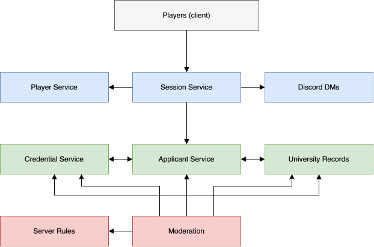

# Student ID, please

A cooperative game about Discord server moderation, built as a microservices project for the PAD course. A team of players runs moderation "shifts" for a university Discord server — one 
Moderator reviews applicants directly, while several Junior Moderators consult scattered university records and credentials to help verify who's really who, before a decision 
(Accept / Reject / Flag / Ban) gets made and checked against the current access rules.

The system is split into 8 microservices, each owning a distinct piece of the game's state — see the boundaries and diagram below.

## Team 17
- Anastasia Tiganescu, FAF-231 — Server Rules + University Record Services
- Catalin Darzu, FAF-231  — Applicant and Credential Services
- Daniela Cojocari, FAF-231  — Moderation + Discord DMS Services
- Janeta Grigoras, FAF-231  — Player + Server Moderation Session Services

---

## Service Boundaries

### Player Service
Owns the identity of the players themselves — accounts, authentication, profiles, friends, XP/levels, and their progression history as moderators, including shifts completed and 
disciplinary actions taken. 

It does not contain any data about the people attempting to join the university server — that responsibility belongs entirely to the applicant-side services 
below. At the end of a shift, it receives the results from the Server Moderation Session Service to update a player's XP and level.

### Server Moderation Session Service
Owns the state of an active moderation shift: which players are in it, their assigned roles (Moderator vs Junior Moderators), the applicant currently being reviewed, how many applications
have been processed, and the running session score and penalties. 

It does not own applicant, credential, or record data, nor the decision logic itself — it only orchestrates the shift. 
It calls the Applicant Service to advance to the next applicant, provisions channels through the Discord DMs Service, and publishes the shift's final results to the Player Service once it ends.

### Applicant Service
Owns an applicant's basic identity — name, student ID, major, year, university status, courses, and role — including cases where an applicant intentionally provides false information. 

It does not own the applicant's credentials or the hidden university records, only references to them. Whichever of Applicant Service, Credential Service, or University Record Service is 
contacted first for a new applicant initializes that applicant's profile and propagates it to the other two, so all three stay in sync.

### Credential Service
Owns the documents an applicant presents — student ID, university email, enrollment confirmation, course registration — and determines their validity, flagging anything expired, forged,
inconsistent, or incomplete. 

It validates structure and authenticity only; it does not decide whether the applicant should actually be admitted. It participates in the same first-contact propagation pattern as Applicant
Service, syncing with both Applicant Service and University Record Service whenever a new applicant appears.

### Server Rules Service
Owns the current access rule set for the Discord server — for example, "only FAF students may join," "first-years can't access certain channels," or "banned students can never re-enter" — 
along with the logic to evaluate an applicant against it. 

It does not store applicant data itself; it's simply handed what it needs, per request, to run that evaluation. It supplies the correctness check the Moderation Service relies on when 
finalizing a decision.

### University Record Service
Owns the hidden, ground-truth university data moderators may need to verify a claim — enrollment lists, course lists, academic year, schedules, and server message records. This information 
is deliberately partitioned across the Junior Moderator players, so a given player can only see the records they've been assigned, never the full picture. It also participates in the 
first-contact propagation pattern, syncing with Applicant Service and Credential Service whenever a new applicant is created.

### Moderation Service
Owns the actual admission decision for each applicant — Accept, Reject, Flag, or Ban — along with whether that decision was correct and the resulting record of violated rules and penalties.

It does not own the rules themselves, nor any raw applicant, credential, or record data — only the outcome of applying them. To reach a decision, it gathers information from the Applicant, 
Credential, and University Record Services, then checks correctness against the Server Rules Service.

### Discord DMs Service
Provides the real-time, Discord-like communication between the Moderator and Junior Moderators, organized into channels tied to the active session (e.g. #enrollment-check, #faculty-check,
#general-mod-chat). Different players have access to different channels depending on what information they've been assigned. 

It transports messages only — it never verifies whether what's being said is actually correct. It relies on the Server Moderation Session Service to know which channels should exist for 
the current session.

## Architecture Diagram



Arrows point from the service that initiates a call to the service it calls.

New applicants can enter through any of Applicant Service, Credential Service or
University Record Service. Whichever is contacted first mints the `applicant_id`,
decides that applicant's `deception`, and publishes its `*_initialized` event; the
other two build their own side of the applicant from it. All three end up describing
the same person, and the deception stays consistent across claim, documents and
records because it is decided once, at the point of entry.

Moderation Service is the only service that reaches into the applicant-data cluster 
after an applicant already exists — it queries Applicant, Credential, and University 
Record Services to gather what it needs before checking the decision against Server Rules.

---

## Technologies and Communication Patterns

### Languages

Two halves, two languages.

**TypeScript / NestJS — Player, Session, Moderation, Discord DMs.**
This half holds live connections: 4 players connected for the whole shift, mostly idle.
Node handles many idle sockets cheaply, and Socket.IO rooms map 1:1 onto Discord channels,
so we don't write socket plumbing. Session and Moderation sit here because score updates and
decision results must reach connected players immediately.
Trade-off: types vanish at runtime, so DTOs are validated with `class-validator` at the edge.

**Java 21 / Spring Boot — Applicant, Credential, Server Rules, University Record.**
This half is data modelling and rule evaluation: claim vs truth, document validity, partitioned
records, rule predicates. Static types, Bean Validation and JPA catch bad state at compile or
validation time instead of during a demo.
Trade-off: heavier services and slower startup — acceptable, since nothing here holds a live connection.

**Pinned:** JDK 21 LTS, Node 20 LTS.

| Service | Pair | Stack | DB |
|---|---|---|---|
| Player | 1 | TypeScript · NestJS | PostgreSQL |
| Server Moderation Session | 1 | TypeScript · NestJS | PostgreSQL |
| Applicant | 2 | Java 21 · Spring Boot, JPA | PostgreSQL |
| Credential | 2 | Java 21 · Spring Boot, JPA | PostgreSQL |
| Server Rules | 3 | Java 21 · Spring Boot | PostgreSQL (rule sets only) |
| University Record | 3 | Java 21 · Spring Boot, JPA | PostgreSQL |
| Moderation | 4 | TypeScript · NestJS | PostgreSQL |
| Discord DMs | 4 | TypeScript · NestJS, Socket.IO | PostgreSQL |

### Communication

| Direction | Protocol | Why |
|---|---|---|
| Client → system | REST + JSON via API gateway | Discrete actions (login, join shift, query record, submit verdict). One place to check the JWT. |
| Client → Discord DMs | WebSocket (Socket.IO) | Chat must be pushed, not polled. |
| Service → service, needs an answer | gRPC | Moderation makes 4 calls (Applicant, Credential, Record, Rules) before answering. The `.proto` is one contract both languages generate from, so Java and TS can't drift. |
| Service → service, fire and forget | RabbitMQ events | `applicant_initialized`, `decision_made`, `shift_ended`. Publisher doesn't wait; a consumer being down doesn't fail the shift. |

### Data management

One database per service. No service reads another's tables — only its API or its events.

Applicant, Credential and University Record hold the same applicant in three databases. Whichever
of the three is contacted first mints the `applicant_id` and the `deception`, then publishes its
`*_initialized` event; the other two build their own side from it. Consumers are idempotent on
`applicant_id`, so a redelivery can't duplicate data, and an applicant is initialized only once no
matter how many of the three events arrive.

Consistency is eventual — acceptable here, since an applicant is only shown to the Moderator after
the session advances to them.

### Conventions

| Thing | Decision |
|---|---|
| Auth | `Authorization: Bearer <JWT>` |
| IDs | UUID v4, as string |
| Timestamps | RFC 3339 UTC — `2026-09-15T14:03:00Z` |
| Errors | `{ "error": { "code": "STRING_CODE", "message": "human text" } }` |
| JSON | `snake_case` |
| Paths | plural — `/applicants/{applicant_id}` |

---
## Communication Contract

Data lives in one database per service. Services never touch each other's tables, only their APIs and events, as described above.

### Player Service

**Client-facing REST (via API Gateway)**

`POST /players` - register a new player account
```json
// Request
{ "username": "string", "email": "string", "password": "string" }

// Response 201
{ "player_id": "uuid", "username": "string", "email": "string", "xp": 0, "level": 1, "created_at": "RFC3339" }
```

**Errors:** `422 VALIDATION_FAILED` if username, email, or password is missing or malformed, `409 EMAIL_ALREADY_REGISTERED` if the email is already in use.

`POST /players/login` - authenticate
```json
// Request
{ "email": "string", "password": "string" }

// Response 200
{ "player_id": "uuid", "token": "jwt string" }
```

**Errors:** `401 INVALID_CREDENTIALS` if the email/password combination is wrong.


`GET /players/{player_id}` - fetch profile
```json
// Response 200
{
  "player_id": "uuid",
  "username": "string",
  "xp": 0,
  "level": 1,
  "friends": ["uuid"],
  "shifts_completed": 0,
  "disciplinary_actions": 0
}
```

**Errors:** `404 PLAYER_NOT_FOUND`.


`PATCH /players/{player_id}` - update profile fields
```json
// Request (any subset)
{ "username": "string", "email": "string" }

// Response 200
{
  "player_id": "uuid",
  "username": "string",
  "xp": 0,
  "level": 1,
  "friends": ["uuid"],
  "shifts_completed": 0,
  "disciplinary_actions": 0
}
```

**Errors:** `422 VALIDATION_FAILED` if a field is malformed, `403 FORBIDDEN` if the caller isn't this player, `404 PLAYER_NOT_FOUND`.


`GET /players/{player_id}/friends` - list a player's friends
```json
// Response 200
{ "friends": [ { "player_id": "uuid", "username": "string" } ] }
```

**Errors:** `404 PLAYER_NOT_FOUND`.


`POST /players/{player_id}/friends` - add another player as a friend
```json
// Request
{ "friend_id": "uuid" }

// Response 200
{ "friends": [ { "player_id": "uuid", "username": "string" } ] }
```

**Errors:** `404 PLAYER_NOT_FOUND` if `friend_id` doesn't exist, `409 ALREADY_FRIENDS` if the friendship already exists.


**Events consumed (RabbitMQ)**

`shift_ended` - published by Session Service when a shift ends.
```json
{
  "session_id": "uuid",
  "results": [
    { "player_id": "uuid", "xp_gained": 0, "shift_completed": true, "disciplinary_action": false }
  ]
}
```
Applied per `player_id` to update `xp`, `level`, `shifts_completed`, `disciplinary_actions`.
Idempotent on `(session_id, player_id)`.

---

### Server Moderation Session Service

**Client-facing REST (via API Gateway)**

`POST /sessions` - create a session
```json
// Response 201
{ "session_id": "uuid", "status": "created", "roles": { "moderator": "uuid", "junior_moderators": ["uuid"] } }
```

**Errors:** `422 VALIDATION_FAILED` if the request is malformed.


`POST /sessions/{session_id}/join` - the calling player (identified via JWT) joins an existing, not-yet-started session as Junior Moderator
```json
// Response 200
{ "session_id": "uuid", "status": "created", "roles": { "moderator": "uuid", "junior_moderators": ["uuid"] } }
```

**Errors:** `404 SESSION_NOT_FOUND`, `409 SESSION_ALREADY_STARTED` if the session is no longer in `created` status, `409 ALREADY_JOINED` if the calling player is already in this session.


`POST /sessions/{session_id}/start` - mark the session active, start the shift, and assign each Junior Moderator the record scope(s) they'll have access to for the whole shift (via
`UniversityRecordService.AssignScopes`, below).
```json
// Response 200
{ "session_id": "uuid", "status": "active", "started_at": "RFC3339" }
```

**Errors:** `403 NOT_MODERATOR` if the caller isn't the session's Moderator, `409 SESSION_ALREADY_STARTED` if it's already active or ended.


`GET /sessions/{session_id}` - full state
```json
// Response 200
{
  "session_id": "uuid",
  "status": "created | active | ended",
  "roles": { "moderator": "uuid", "junior_moderators": ["uuid"] },
  "current_applicant_id": "uuid | null",
  "processed_count": 0,
  "score": 0,
  "started_at": "RFC3339 | null",
  "ended_at": "RFC3339 | null"
}
```

**Errors:** `404 SESSION_NOT_FOUND`.


`GET /sessions/{session_id}/current-applicant` - the applicant currently under review
```json
// Response 200
{ "applicant_id": "uuid | null", "processed_count": 0 }
```

**Errors:** `404 SESSION_NOT_FOUND`.


`POST /sessions/{session_id}/end` - end the shift and finalize results
```json
// Response 200
{
  "session_id": "uuid",
  "status": "ended",
  "final_score": 0,
  "results": [ { "player_id": "uuid", "xp_gained": 0, "shift_completed": true, "disciplinary_action": false } ]
}
```

**Errors:** `403 NOT_MODERATOR` if the caller isn't the session's Moderator, `409 SESSION_NOT_ACTIVE` if the session isn't currently active.

Triggers publishing `shift_ended` (below).

**Outgoing gRPC calls (needs an answer)**

`ApplicantService.GetNextApplicant`
```proto
rpc GetNextApplicant (NextApplicantRequest) returns (NextApplicantResponse);
message NextApplicantRequest { string session_id = 1; }
message NextApplicantResponse { string applicant_id = 1; }
```

`DiscordDmsService.ProvisionChannels`
```proto
rpc ProvisionChannels (ProvisionChannelsRequest) returns (ProvisionChannelsResponse);
message ProvisionChannelsRequest {
  string session_id = 1;
  repeated string participant_ids = 2;
}
message ProvisionChannelsResponse { repeated Channel channels = 1; }
message Channel { string channel_id = 1; string name = 2; }
```

`UniversityRecordService.AssignScopes`
```proto
rpc AssignScopes (AssignScopesRequest) returns (AssignScopesResponse);
message AssignScopesRequest {
  string session_id = 1;
  repeated PlayerScopeAssignment assignments = 2;
}
message PlayerScopeAssignment {
  string player_id = 1;
  repeated string scopes = 2; // enrollment | courses | schedule | messages
}
message AssignScopesResponse { bool success = 1; }
```

**Events published (RabbitMQ)**

`shift_ended` - published when a shift ends.
```json
{
  "session_id": "uuid",
  "results": [
    { "player_id": "uuid", "xp_gained": 0, "shift_completed": true, "disciplinary_action": false }
  ]
}
```

**Events consumed (RabbitMQ)**

`decision_made` - published by Moderation Service after each verdict.
```json
{
  "session_id": "uuid",
  "applicant_id": "uuid",
  "verdict": "accept | reject | flag | ban",
  "correct": true,
  "penalty": 0
}
```
Applied to update `score`, `processed_count`, clear `current_applicant_id`, and trigger the next
`GetNextApplicant` call.

### Applicant Service

**Client-facing REST (via API Gateway)**

`POST /applicants` - generate a new applicant profile for a moderation session
```json
// Request
{ "session_id": "uuid" }

// Response 201
{
  "applicant_id": "uuid",
  "name": "string",
  "student_id": "string",
  "major": "string",
  "year": 0,
  "university_status": "faf_student | other_major | teaching_assistant | staff | alumni | outsider",
  "courses": ["string"],
  "role": "string"
}
```
`deception` is stored internally and travels between the three applicant-side services over
RabbitMQ, but it is never returned in any player-facing response, and it is not part of any gRPC
message either — not even the one Moderation Service calls. It is the ground-truth answer the game
is built around: a player who could read it would have nothing left to investigate, and a player
who could infer it from what Moderation returns before submitting a verdict would have the same
advantage. Correctness is decided by Server Rules Service from the claim, the documents and the
records — never from `deception` itself.


**Errors:** `404 SESSION_NOT_FOUND` if the session does not exist, `409 SESSION_NOT_ACTIVE` if it
has already ended.

`GET /applicants/{applicant_id}` - fetch an applicant's profile
```json
// Response 200
{
  "applicant_id": "uuid",
  "name": "string",
  "student_id": "string",
  "major": "string",
  "year": 0,
  "university_status": "faf_student | other_major | teaching_assistant | staff | alumni | outsider",
  "courses": ["string"],
  "role": "string"
}
```

**Errors:** `404 APPLICANT_NOT_FOUND`.

**Incoming gRPC**

`ApplicantService.GetNextApplicant` - called by Server Moderation Session Service to advance a
shift to its next applicant. Generates the applicant if the session has none pending.

```proto
rpc GetNextApplicant (NextApplicantRequest) returns (NextApplicantResponse);

message NextApplicantRequest { string session_id = 1; }

message NextApplicantResponse { string applicant_id = 1; }
```

`ApplicantService.GetApplicant` - returns the applicant's claimed profile so Moderation can check a
decision against the rules. Server-to-server, so it does not pass through the API Gateway.
`deception` is not part of the message.

```proto
rpc GetApplicant (GetApplicantRequest) returns (Applicant);

message GetApplicantRequest { string applicant_id = 1; }

message Applicant {
  string applicant_id = 1;
  string name = 2;
  string student_id = 3;
  string major = 4;
  int32 year = 5;
  string university_status = 6;
  repeated string courses = 7;
  string role = 8;
}
```


**Events published (RabbitMQ)**

`applicant_initialized` - published when Applicant Service is contacted first for a new applicant.
```json
{
  "applicant_id": "uuid",
  "deception": "none | false_major | false_year | impersonation | expired_status",
  "name": "string",
  "student_id": "string",
  "major": "string",
  "year": 0,
  "university_status": "faf_student | other_major | teaching_assistant | staff | alumni | outsider",
  "courses": ["string"],
  "role": "string"
}
```
Consumed by Credential Service and University Record Service to build their own documents/records
for this applicant, so all three stay in sync.

**Events consumed (RabbitMQ)**

`credential_initialized` - published by Credential Service when it's contacted first instead.
```json
{
  "applicant_id": "uuid",
  "deception": "none | false_major | false_year | impersonation | expired_status",
  "name": "string",
  "student_id": "string",
  "student_id_doc": { "valid": true, "issue": "none | expired | forged | inconsistent | incomplete" },
  "university_email": "string",
  "enrollment_confirmation": { "valid": true, "issue": "none | expired | forged | inconsistent | incomplete" },
  "course_registration": ["string"]
}
```

`record_initialized` - published by University Record Service when it's contacted first instead.
```json
{
  "applicant_id": "uuid",
  "enrollment_status": "string",
  "academic_year": 0,
  "courses": ["string"]
}
```

Applicant Service builds its profile from whichever of these arrives, if it wasn't the one that
initialized the applicant itself, and takes `deception` from that event rather than deciding its
own. That is what keeps the claim, the documents and the records describing the same lie.
Idempotent on `applicant_id` — an applicant is only initialized once, however many of the events arrive.

---

### Credential Service

**Client-facing REST (via API Gateway)**

`POST /credentials` - generate credentials for a new applicant, when Credential Service is the
first of the three applicant-side services to be contacted. It mints the `applicant_id` and the
`deception`, then propagates both through `credential_initialized`.
```json
// Request
{ "session_id": "uuid" }

// Response 201
{
  "applicant_id": "uuid",
  "student_id_doc": { "valid": true, "issue": "none | expired | forged | inconsistent | incomplete" },
  "university_email": "string",
  "enrollment_confirmation": { "valid": true, "issue": "none | expired | forged | inconsistent | incomplete" },
  "course_registration": ["string"]
}
```

**Errors:** `404 SESSION_NOT_FOUND` if the session does not exist, `409 SESSION_NOT_ACTIVE` if it
has already ended.

`GET /credentials/{applicant_id}` - fetch an applicant's credentials and their validity
```json
// Response 200
{
  "applicant_id": "uuid",
  "student_id_doc": { "valid": true, "issue": "none | expired | forged | inconsistent | incomplete" },
  "university_email": "string",
  "enrollment_confirmation": { "valid": true, "issue": "none | expired | forged | inconsistent | incomplete" },
  "course_registration": ["string"]
}
```

**Errors:** `404 APPLICANT_NOT_FOUND` if no credentials exist for that applicant.

**Incoming gRPC**

`CredentialService.GetCredentials` - returns the applicant's documents and their validity so
Moderation can check a decision against the rules. Server-to-server, so it does not pass through
the API Gateway. It returns the same verdict the players see; this service still never compares a
document against University Record data.

```proto
rpc GetCredentials (GetCredentialsRequest) returns (Credentials);

message GetCredentialsRequest { string applicant_id = 1; }

message Credentials {
  string applicant_id = 1;
  DocumentStatus student_id_doc = 2;
  string university_email = 3;
  DocumentStatus enrollment_confirmation = 4;
  repeated string course_registration = 5;
}

message DocumentStatus { bool valid = 1; string issue = 2; }
```


**Events published (RabbitMQ)**

`credential_initialized` - published when Credential Service is the first to be contacted for a new applicant.
```json
{
  "applicant_id": "uuid",
  "deception": "none | false_major | false_year | impersonation | expired_status",
  "name": "string",
  "student_id": "string",
  "student_id_doc": { "valid": true, "issue": "none | expired | forged | inconsistent | incomplete" },
  "university_email": "string",
  "enrollment_confirmation": { "valid": true, "issue": "none | expired | forged | inconsistent | incomplete" },
  "course_registration": ["string"]
}
```
Consumed by Applicant Service and University Record Service to build their own data for this
applicant.

**Events consumed (RabbitMQ)**

`applicant_initialized` - published by Applicant Service when it's contacted first instead.
```json
{
  "applicant_id": "uuid",
  "deception": "none | false_major | false_year | impersonation | expired_status",
  "name": "string",
  "student_id": "string",
  "major": "string",
  "year": 0,
  "university_status": "faf_student | other_major | teaching_assistant | staff | alumni | outsider",
  "courses": ["string"],
  "role": "string"
}
```

`record_initialized` - published by University Record Service when it's contacted first instead.
```json
{
  "applicant_id": "uuid",
  "enrollment_status": "string",
  "academic_year": 0,
  "courses": ["string"]
}
```
Credential Service builds its documents from whichever event arrives, if it wasn't the one that
initialized the applicant itself, and forges them according to that event's `deception` — so a
document contradicts the records in a specific, discoverable way instead of at random.
Idempotent on `applicant_id`.

---
### Server Rules Service

Holds no applicant data — evaluates whatever it's handed, per request.

**Client-facing REST (via API Gateway)**

`GET /rules` - fetch the current active rule set
```json
// Response 200
{
  "rules": [
    { "rule_id": "uuid", "description": "string", "condition": "string" }
  ]
}
```

`PUT /rules` - replace the active rule set (Moderator only, between shifts)
```json
// Request
{
  "rules": [
    { "description": "string", "condition": "string" }
  ]
}

// Response 200
{
  "rules": [
    { "rule_id": "uuid", "description": "string", "condition": "string" }
  ]
}
```

No events published or consumed — Server Rules Service doesn't participate in the applicant propagation pattern.

---

### University Record Service

**Client-facing REST (via API Gateway)**

`POST /records` - generate ground-truth records for a new applicant (used if University Record Service is contacted first)
```json
// Request
{ "applicant_id": "uuid" }

// Response 201
{
  "applicant_id": "uuid",
  "enrollment_status": "string",
  "academic_year": 0,
  "courses": ["string"],
  "previously_banned": false
}
```

`GET /sessions/{session_id}/records/{applicant_id}` - fetch the records the calling player is assigned to see, for this applicant, in this session
```json
// Request
// header: Authorization: Bearer <JWT>   (identifies the calling player)

// Response 200
{
  "assigned_scopes": ["enrollment"],
  "data": { "enrollment": { "enrollment_status": "string" } }
}

// Response 403 — player has no scope assignment for this session
{ "error": { "code": "NOT_ASSIGNED_TO_SESSION", "message": "human text" } }
```
The service no longer trusts a client-supplied `scope` value. Instead it looks up which scope(s)
the calling player (from the JWT) was assigned via `AssignScopes` — a gRPC call made by Server
Moderation Session Service when the shift starts — and returns only that data. A player who
wasn't in the session, or has no assignment, gets `403`. This is the actual enforcement point
for the partitioning promised in Service Boundaries.

**Incoming gRPC (called by Server Moderation Session Service at shift start)**

`AssignScopes`
```proto
rpc AssignScopes (AssignScopesRequest) returns (AssignScopesResponse);
message AssignScopesRequest {
  string session_id = 1;
  repeated PlayerScopeAssignment assignments = 2;
}
message PlayerScopeAssignment {
  string player_id = 1;
  repeated string scopes = 2; // enrollment | courses | schedule | messages
}
message AssignScopesResponse { bool success = 1; }
```

**Events published (RabbitMQ)**

`record_initialized` - published when University Record Service is the first to be contacted for a new applicant.
```json
{
  "applicant_id": "uuid",
  "enrollment_status": "string",
  "academic_year": 0,
  "courses": ["string"],
  "previously_banned": false
}
```
Consumed by Applicant Service and Credential Service to build their own data for this applicant.

**Events consumed (RabbitMQ)**

`applicant_initialized` - published by Applicant Service when it's contacted first instead.
```json
{
  "applicant_id": "uuid",
  "deception": "none | false_major | false_year | impersonation | expired_status",
  "name": "string",
  "student_id": "string",
  "major": "string",
  "year": 0,
  "university_status": "faf_student | other_major | teaching_assistant | staff | alumni | outsider",
  "courses": ["string"],
  "role": "string"
}
```

`credential_initialized` - published by Credential Service when it's contacted first instead.
```json
{
  "applicant_id": "uuid",
  "deception": "none | false_major | false_year | impersonation | expired_status",
  "name": "string",
  "student_id": "string",
  "student_id_doc": { "valid": true, "issue": "none | expired | forged | inconsistent | incomplete" },
  "university_email": "string",
  "enrollment_confirmation": { "valid": true, "issue": "none | expired | forged | inconsistent | incomplete" },
  "course_registration": ["string"]
}
```
University Record Service builds its records from whichever event arrives, if it wasn't the one that initialized the applicant itself. Idempotent on `applicant_id`.

---

### Moderation Service

**Client-facing REST (via API Gateway)**

`POST /sessions/{session_id}/applicants/{applicant_id}/decision` - submit a verdict for the current applicant
```json
// Request
{ "verdict": "accept | reject | flag | ban" }

// Response 200
{
  "applicant_id": "uuid",
  "verdict": "accept | reject | flag | ban",
  "correct": true,
  "violated_rule_ids": ["uuid"],
  "penalty": 0
}
```

**Outgoing gRPC calls (needs an answer)**

`ApplicantService.GetApplicant`
```proto
rpc GetApplicant (GetApplicantRequest) returns (Applicant);
message GetApplicantRequest { string applicant_id = 1; }
message Applicant {
  string applicant_id = 1;
  string name = 2;
  string student_id = 3;
  string major = 4;
  int32 year = 5;
  string university_status = 6;
  repeated string courses = 7;
  string role = 8;
}
```

`CredentialService.GetCredentials`
```proto
rpc GetCredentials (GetCredentialsRequest) returns (Credentials);
message GetCredentialsRequest { string applicant_id = 1; }
message Credentials {
  string applicant_id = 1;
  DocumentStatus student_id_doc = 2;
  string university_email = 3;
  DocumentStatus enrollment_confirmation = 4;
  repeated string course_registration = 5;
}
message DocumentStatus { bool valid = 1; string issue = 2; }
```

`UniversityRecordService.GetRecordSnapshot`
```proto
rpc GetRecordSnapshot (GetRecordSnapshotRequest) returns (RecordSnapshot);
message GetRecordSnapshotRequest { string applicant_id = 1; }
message RecordSnapshot {
  string applicant_id = 1;
  string enrollment_status = 2;
  int32 academic_year = 3;
  repeated string courses = 4;
  bool previously_banned = 5;
}
```
Unscoped — returns the full record regardless of player assignment, since this call is server-to-server, not client-facing.

`ServerRulesService.EvaluateApplicant`
```proto
rpc EvaluateApplicant (EvaluateApplicantRequest) returns (EvaluateApplicantResponse);
message EvaluateApplicantRequest {
  string applicant_id = 1;
  string university_status = 2;
  int32 year = 3;
  repeated string courses = 4;
  bool credentials_valid = 5;
  bool previously_banned = 6;
}
message EvaluateApplicantResponse {
  bool allowed = 1;
  repeated string violated_rule_ids = 2;
}
```
`EvaluateApplicantRequest` is assembled by Moderation Service from the three responses above — Server Rules Service never fetches applicant data itself.

**Events published (RabbitMQ)**

`decision_made` - published after each verdict.
```json
{
  "session_id": "uuid",
  "applicant_id": "uuid",
  "verdict": "accept | reject | flag | ban",
  "correct": true,
  "penalty": 0
}
```
Consumed by Server Moderation Session Service to update `score`, `processed_count`, clear `current_applicant_id`, and trigger the next `GetNextApplicant` call.

---

### Discord DMs Service

**Client-facing REST (via API Gateway)**

`GET /sessions/{session_id}/channels` - list channels for a session and who can access each
```json
// Response 200
{
  "channels": [
    { "channel_id": "uuid", "name": "string", "allowed_player_ids": ["uuid"] }
  ]
}
```

**WebSocket protocol (Socket.IO, connect with `Authorization: Bearer <JWT>`)**

Client → server, `join_channel`
```json
{ "channel_id": "uuid" }
```

Client → server, `send_message`
```json
{ "channel_id": "uuid", "text": "string" }
```

Server → client, `message`
```json
{ "channel_id": "uuid", "author_id": "uuid", "text": "string", "sent_at": "RFC3339" }
```

Server → client, `error`
```json
{ "error": { "code": "CHANNEL_NOT_ALLOWED", "message": "human text" } }
```

Room membership is checked against `allowed_player_ids` (received from Session Service via `ProvisionChannels`) at `join_channel` time — a player never receives messages for a channel they weren't granted.

No RabbitMQ events — the service only transports messages, it doesn't react to anything asynchronously.

## GitHub Workflow

### Branches

| Branch | Role |
|---|---|
| `main` | Presented state. Only ever receives merges from `dev`. Tagged per lab. |
| `dev` | Integration branch. All feature work merges here first. |
| feature branches | Short-lived, one per task, deleted after merge. |

Both `main` and `dev` are protected: no direct pushes, pull request required.

### Branch naming

```
feat/<service>-<slug>     feat/credential-document-validation
fix/<service>-<slug>      fix/applicant-duplicate-events
docs/<slug>               docs/github-workflow
chore/<slug>              chore/submodules-anastasia
```

Lowercase, hyphen-separated, `<service>` matches the directory under `services/`.

### Merging

- feature branch → `dev`: **squash merge**, so `dev` keeps one commit per task
- `dev` → `main`: **merge commit**, so the integration history is preserved
- **1 approval required** — a team of four stalls on two
- The branch is deleted after merge

Rebase on `dev` before opening a PR; do not merge `dev` into your feature branch.

### Commit messages

One capitalised imperative sentence, no prefix, no body.

```
Create README.md with service boundaries
Link Applicant and Credential services as submodules
```

### Pull request contents

Every PR states:

1. **What** changed
2. **Why** — the task or decision behind it
3. **How it was tested** — commands run, or "docs only"
4. **Linked task** from the project board

A PR touching a service someone else owns needs that owner's approval, not just any.

### Test coverage

No code exists yet, so nothing is enforced at Lab 0. From Lab 1:

- unit tests for business logic — validation rules, rule evaluation, deception generation
- integration tests for every endpoint listed in the communication contract
- target **60% line coverage** per service; a PR that lowers coverage explains why
- the test command runs in the service's Dockerfile build, so a broken test fails the image

### Versioning

Semantic versioning, tagged on `main` after each lab is presented:

```
v0.1.0   Lab 0 — planning and contract
v0.2.0   Lab 1 — first running services
```

Service repositories are tagged independently once they publish images; the CPR tag records
which submodule commits made up a presented state.
